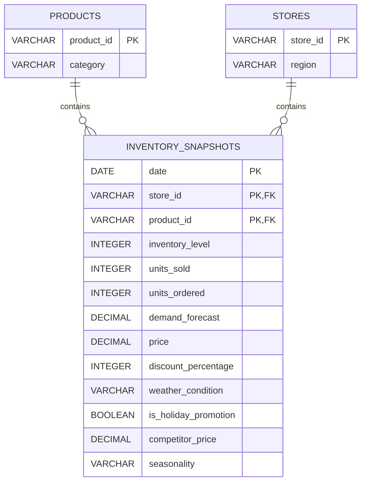

## Solving Inventory Inefficiencies: Database Schema Design

This document outlines the normalized relational schema designed for the Urban Retail Co. inventory analysis project. The schema is named `solving_inventory` as requested.

### Schema Rationale

The original dataset (`retail_store_inventory.csv`) is denormalized, containing information about products, stores, and daily inventory/sales snapshots in a single flat structure. To improve data integrity, reduce redundancy, and optimize for SQL queries, the data is normalized into the following tables:

1.  **Products:** Stores unique information about each product.
2.  **Stores:** Stores unique information about each retail store.
3.  **InventorySnapshots:** Acts as the central fact table, recording the state of inventory, sales, and related metrics for each product in each store on a specific date. Foreign keys link this table to `Products` and `Stores`.

Attributes like `Weather Condition`, `Holiday/Promotion`, and `Seasonality` are kept within the `InventorySnapshots` table as they pertain to the specific conditions on the snapshot date for that store/product combination.

### Table Definitions

**1. Products Table**

*   **Purpose:** Stores details about each unique product.
*   **Columns:**
    *   `product_id` VARCHAR PRIMARY KEY - Unique identifier for the product (e.g., 'P0001').
    *   `category` VARCHAR - Category the product belongs to (e.g., 'Groceries', 'Electronics').

**2. Stores Table**

*   **Purpose:** Stores details about each unique retail store.
*   **Columns:**
    *   `store_id` VARCHAR PRIMARY KEY - Unique identifier for the store (e.g., 'S001').
    *   `region` VARCHAR - Geographic region where the store is located (e.g., 'North', 'South').

**3. InventorySnapshots Table**

*   **Purpose:** Records daily inventory levels, sales, orders, forecasts, and related contextual information.
*   **Columns:**
    *   `date` DATE - The date of the snapshot.
    *   `store_id` VARCHAR - Foreign key referencing `Stores.store_id`.
    *   `product_id` VARCHAR - Foreign key referencing `Products.product_id`.
    *   `inventory_level` INTEGER - Stock level at the time of the snapshot.
    *   `units_sold` INTEGER - Number of units sold on that date.
    *   `units_ordered` INTEGER - Number of units ordered on that date.
    *   `demand_forecast` DECIMAL - Forecasted demand for the product.
    *   `price` DECIMAL - Selling price of the product on that date.
    *   `discount_percentage` INTEGER - Discount percentage applied (0-100).
    *   `weather_condition` VARCHAR - Weather condition on that date (e.g., 'Rainy', 'Sunny').
    *   `is_holiday_promotion` BOOLEAN - Flag indicating if a holiday or promotion was active (True/False).
    *   `competitor_price` DECIMAL - Competitor's price for a similar product on that date.
    *   `seasonality` VARCHAR - Season associated with the date (e.g., 'Autumn', 'Summer').
*   **Primary Key:** Composite key (`date`, `store_id`, `product_id`).
*   **Foreign Keys:**
    *   (`store_id`) REFERENCES `Stores` (`store_id`)
    *   (`product_id`) REFERENCES `Products` (`product_id`)

### Entity Relationship Diagram (ERD) - Mermaid Syntax

This schema provides a structured foundation for the SQL analysis required by the project.
