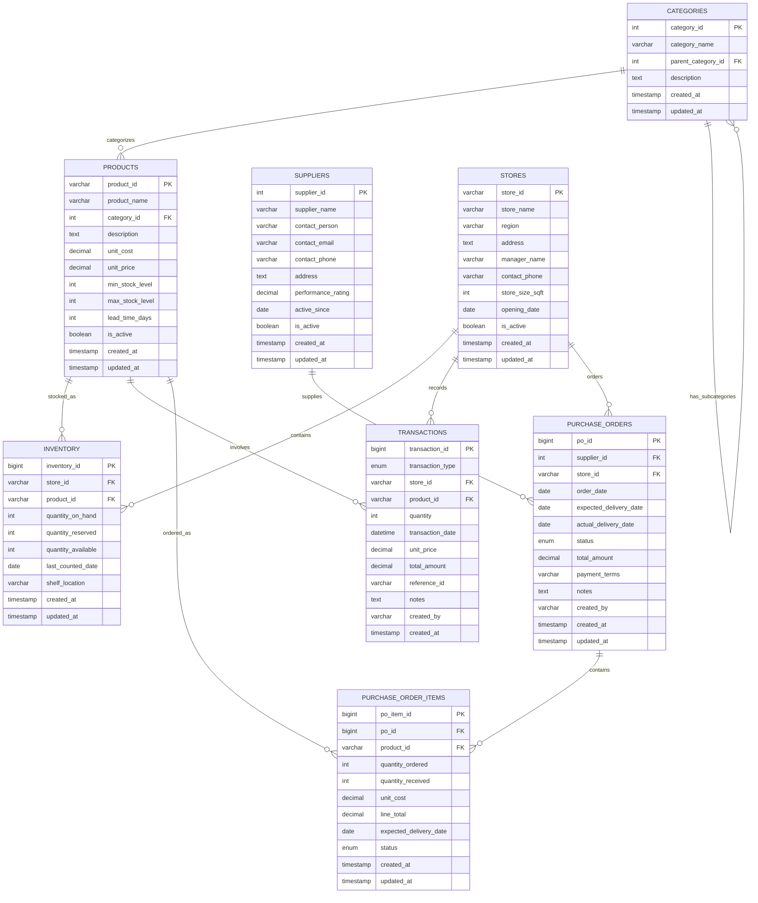

## Solving Inventory Inefficiencies: Enhanced Database Schema Design

This document outlines the normalized relational schema designed for the Urban Retail Co. inventory analysis project. The schema is named `solving_inventory` as requested.

### Schema Rationale

The original dataset (`retail_store_inventory.csv`) has been normalized into a comprehensive 8-table schema to improve data integrity, reduce redundancy, and optimize for SQL queries. This enhanced design supports advanced inventory management features including automated reorder triggers, supplier performance tracking, and detailed transaction history.

### Table Definitions

**1. Products Table**

*   **Purpose:** Stores comprehensive details about each unique product.
*   **Columns:**
    *   `product_id` VARCHAR(50) PRIMARY KEY - Unique identifier for the product
    *   `product_name` VARCHAR(200) NOT NULL - Name of the product
    *   `category_id` INT NOT NULL - Foreign key to Categories table
    *   `description` TEXT - Detailed product description
    *   `unit_cost` DECIMAL(10,2) NOT NULL - Cost price per unit
    *   `unit_price` DECIMAL(10,2) NOT NULL - Standard selling price per unit
    *   `min_stock_level` INT NOT NULL - Minimum stock level before reorder
    *   `max_stock_level` INT NOT NULL - Maximum recommended stock level
    *   `lead_time_days` INT NOT NULL - Average lead time for restocking in days
    *   `is_active` BOOLEAN DEFAULT TRUE - Whether the product is active in inventory
    *   `created_at` TIMESTAMP DEFAULT CURRENT_TIMESTAMP - Record creation timestamp
    *   `updated_at` TIMESTAMP DEFAULT CURRENT_TIMESTAMP ON UPDATE CURRENT_TIMESTAMP - Last update timestamp

**2. Categories Table**

*   **Purpose:** Organizes products into hierarchical categories.
*   **Columns:**
    *   `category_id` INT AUTO_INCREMENT PRIMARY KEY - Unique identifier for the category
    *   `category_name` VARCHAR(100) NOT NULL - Name of the category
    *   `parent_category_id` INT - Self-referencing foreign key for hierarchical categories
    *   `description` TEXT - Category description
    *   `created_at` TIMESTAMP DEFAULT CURRENT_TIMESTAMP - Record creation timestamp
    *   `updated_at` TIMESTAMP DEFAULT CURRENT_TIMESTAMP ON UPDATE CURRENT_TIMESTAMP - Last update timestamp

**3. Suppliers Table**

*   **Purpose:** Stores information about product suppliers.
*   **Columns:**
    *   `supplier_id` INT AUTO_INCREMENT PRIMARY KEY - Unique identifier for the supplier
    *   `supplier_name` VARCHAR(200) NOT NULL - Name of the supplier
    *   `contact_person` VARCHAR(100) - Name of primary contact
    *   `contact_email` VARCHAR(100) - Email address of primary contact
    *   `contact_phone` VARCHAR(20) - Phone number of primary contact
    *   `address` TEXT - Physical address of the supplier
    *   `performance_rating` DECIMAL(3,2) - Rating based on delivery time, quality, etc. (1.00-5.00)
    *   `active_since` DATE - Date when relationship with supplier began
    *   `is_active` BOOLEAN DEFAULT TRUE - Whether the supplier is currently active
    *   `created_at` TIMESTAMP DEFAULT CURRENT_TIMESTAMP - Record creation timestamp
    *   `updated_at` TIMESTAMP DEFAULT CURRENT_TIMESTAMP ON UPDATE CURRENT_TIMESTAMP - Last update timestamp

**4. Stores Table**

*   **Purpose:** Stores details about each retail store location.
*   **Columns:**
    *   `store_id` VARCHAR(50) PRIMARY KEY - Unique identifier for the store
    *   `store_name` VARCHAR(100) NOT NULL - Name of the store
    *   `region` VARCHAR(100) NOT NULL - Geographic region where the store is located
    *   `address` TEXT NOT NULL - Physical address of the store
    *   `manager_name` VARCHAR(100) - Name of the store manager
    *   `contact_phone` VARCHAR(20) - Store contact phone number
    *   `store_size_sqft` INT - Size of the store in square feet
    *   `opening_date` DATE - Date when the store opened
    *   `is_active` BOOLEAN DEFAULT TRUE - Whether the store is currently active
    *   `created_at` TIMESTAMP DEFAULT CURRENT_TIMESTAMP - Record creation timestamp
    *   `updated_at` TIMESTAMP DEFAULT CURRENT_TIMESTAMP ON UPDATE CURRENT_TIMESTAMP - Last update timestamp

**5. Inventory Table**

*   **Purpose:** Tracks current inventory levels across all stores.
*   **Columns:**
    *   `inventory_id` BIGINT AUTO_INCREMENT PRIMARY KEY - Unique identifier for inventory record
    *   `store_id` VARCHAR(50) NOT NULL - Foreign key to Stores table
    *   `product_id` VARCHAR(50) NOT NULL - Foreign key to Products table
    *   `quantity_on_hand` INT NOT NULL - Current stock level
    *   `quantity_reserved` INT DEFAULT 0 - Stock reserved for orders but not yet shipped
    *   `quantity_available` INT GENERATED ALWAYS AS (quantity_on_hand - quantity_reserved) STORED - Available stock
    *   `last_counted_date` DATE - Date of last physical inventory count
    *   `shelf_location` VARCHAR(50) - Physical location within the store
    *   `created_at` TIMESTAMP DEFAULT CURRENT_TIMESTAMP - Record creation timestamp
    *   `updated_at` TIMESTAMP DEFAULT CURRENT_TIMESTAMP ON UPDATE CURRENT_TIMESTAMP - Last update timestamp
*   **Constraints:**
    *   UNIQUE KEY (`store_id`, `product_id`) - Ensures one inventory record per product per store

**6. Transactions Table**

*   **Purpose:** Records all inventory movements (sales, receipts, adjustments, transfers).
*   **Columns:**
    *   `transaction_id` BIGINT AUTO_INCREMENT PRIMARY KEY - Unique identifier for the transaction
    *   `transaction_type` ENUM('SALE', 'RECEIPT', 'ADJUSTMENT', 'TRANSFER_OUT', 'TRANSFER_IN') NOT NULL - Type of transaction
    *   `store_id` VARCHAR(50) NOT NULL - Foreign key to Stores table
    *   `product_id` VARCHAR(50) NOT NULL - Foreign key to Products table
    *   `quantity` INT NOT NULL - Quantity involved in the transaction (positive or negative)
    *   `transaction_date` DATETIME NOT NULL - Date and time of the transaction
    *   `unit_price` DECIMAL(10,2) - Unit price at time of transaction (for sales)
    *   `total_amount` DECIMAL(10,2) - Total monetary value of the transaction
    *   `reference_id` VARCHAR(100) - Reference to external system (e.g., order number, invoice number)
    *   `notes` TEXT - Additional transaction details
    *   `created_by` VARCHAR(50) - User who created the transaction
    *   `created_at` TIMESTAMP DEFAULT CURRENT_TIMESTAMP - Record creation timestamp

**7. Purchase_Orders Table**

*   **Purpose:** Manages orders placed to suppliers for restocking.
*   **Columns:**
    *   `po_id` BIGINT AUTO_INCREMENT PRIMARY KEY - Unique identifier for the purchase order
    *   `supplier_id` INT NOT NULL - Foreign key to Suppliers table
    *   `store_id` VARCHAR(50) NOT NULL - Foreign key to Stores table (destination)
    *   `order_date` DATE NOT NULL - Date when the order was placed
    *   `expected_delivery_date` DATE - Expected date of delivery
    *   `actual_delivery_date` DATE - Actual date of delivery (NULL if not yet delivered)
    *   `status` ENUM('DRAFT', 'SUBMITTED', 'CONFIRMED', 'SHIPPED', 'DELIVERED', 'CANCELLED') NOT NULL - Current status of the order
    *   `total_amount` DECIMAL(12,2) - Total monetary value of the order
    *   `payment_terms` VARCHAR(100) - Payment terms for the order
    *   `notes` TEXT - Additional order details
    *   `created_by` VARCHAR(50) - User who created the order
    *   `created_at` TIMESTAMP DEFAULT CURRENT_TIMESTAMP - Record creation timestamp
    *   `updated_at` TIMESTAMP DEFAULT CURRENT_TIMESTAMP ON UPDATE CURRENT_TIMESTAMP - Last update timestamp

**8. Purchase_Order_Items Table**

*   **Purpose:** Details individual line items within purchase orders.
*   **Columns:**
    *   `po_item_id` BIGINT AUTO_INCREMENT PRIMARY KEY - Unique identifier for the purchase order item
    *   `po_id` BIGINT NOT NULL - Foreign key to Purchase_Orders table
    *   `product_id` VARCHAR(50) NOT NULL - Foreign key to Products table
    *   `quantity_ordered` INT NOT NULL - Quantity ordered
    *   `quantity_received` INT DEFAULT 0 - Quantity received so far
    *   `unit_cost` DECIMAL(10,2) NOT NULL - Cost per unit
    *   `line_total` DECIMAL(12,2) GENERATED ALWAYS AS (quantity_ordered * unit_cost) STORED - Total cost for this line item
    *   `expected_delivery_date` DATE - Expected delivery date for this specific item
    *   `status` ENUM('PENDING', 'PARTIAL', 'COMPLETE', 'CANCELLED') NOT NULL DEFAULT 'PENDING' - Status of this line item
    *   `created_at` TIMESTAMP DEFAULT CURRENT_TIMESTAMP - Record creation timestamp
    *   `updated_at` TIMESTAMP DEFAULT CURRENT_TIMESTAMP ON UPDATE CURRENT_TIMESTAMP - Last update timestamp

### Entity Relationship Diagram (ERD) - Mermaid Syntax

### Indexing Strategy

To optimize query performance, the following indexes have been implemented:

1. **Primary Keys:** All tables have primary keys for fast record retrieval.
2. **Foreign Keys:** Indexes on all foreign key columns to speed up joins.
3. **Composite Indexes:** 
   - On Inventory table: (store_id, product_id) for quick lookups
   - On Transactions table: (store_id, product_id, transaction_date) for filtered queries
   - On Purchase_Order_Items table: (po_id, product_id) for efficient joins
4. **Performance Indexes:**
   - On Products table: (category_id, is_active) for filtered category queries
   - On Inventory table: (quantity_on_hand) for stock level queries
   - On Transactions table: (transaction_date) for date range queries
   - On Purchase_Orders table: (status, expected_delivery_date) for pending orders

This schema provides a robust foundation for the SQL analysis, triggers, and stored procedures required by the project.
